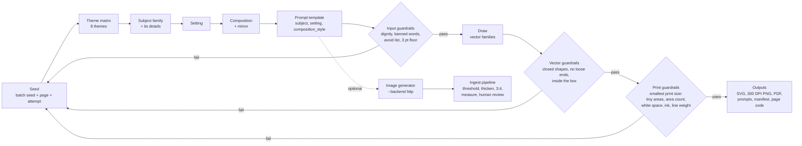

# Infinite coloring pages: the generator

Cognicopia's page generator makes new, print-ready coloring pages on demand: as many as a facility needs, each one different, and each one held to the same clinical print standard as the curated library ([cognicore-coloring-standards.md](cognicore-coloring-standards.md)). Staff use it in the Packet Builder (**Coloring → New pages**). Activity directors and developers can also run it from the command line to produce a batch of SVG, 300 DPI PNG and PDF files.

Everything here runs on the user's own computer. The browser tool sends nothing anywhere. The command line reaches the network only when someone asks it to fetch pictures from an image generator (`--backend http`, section 7).

| | |
|---|---|
| Engine | `assets/cognicore/infinite.js` (seeds, theme matrix, settings, compositions, prompt templates, guardrails, batches) |
| Subject families | `assets/cognicore/generators/*.js` (nine families, below) |
| Quality meter | `assets/cognicore/quality.js` (prints a page to a bitmap and measures it; shared by the browser and Node) |
| Command line | `scripts/generate_infinite_pages.mjs` (`npm run pages`) |
| PDF writer | `scripts/lib/pdf-lite.mjs` |
| Tests | `scripts/check-infinite.mjs` (part of `npm test`) |
| In the builder | `builder.html`, the coloring library's **New pages** tab |

## 1. How the requirements are met

| Requirement | How the generator meets it | Where it is enforced |
|---|---|---|
| **Infinite variety** | A seed picks a theme, a subject family, that family's details (era, body style, species, vase, flower, plant, building...), a setting and a composition, and mirrors half the pages. About 33,000 distinct layouts at each tier, before continuous proportions are counted (section 4). A batch never repeats a page and spreads its subjects. | `spec()`, `batch()` |
| **Quality guardrails** | Input checks on every page's words, vector checks on every drawing, and a print measurement of every page at its smallest printed size. A page that fails is drawn again from the next seed. | `guard()`, `inspect()`, `measure()`, `check()` |
| **Bold, continuous black lines (3–5 pt and up)** | Lines are set by the tier, never by the drawing: 3 pt (Tier 1), 4.5 pt (Tier 2), 7.9 pt (Tier 3). Interior detail lines never go under 3 pt. Pure black on pure white: no gray, shading, hatching or texture is possible in the output. | `lineart.js` `WEIGHTS`, `MIN_LINE_PT`; checked again on the written SVG and PNG |
| **Closed boundaries** | Every colorable part is a closed outline. A line must end on another line or under a shape: a page with a single loose line end is refused. | `inspect()` |
| **Adult, realistic, dignified subjects** | Families draw real things (cars, tools, birds, teapots, radios, farmhouses, fruit) in true proportions, eyes as small solid dots. Titles, captions and prompts pass the dignity filter (no childish, quizzing or talking-down words) and a banned-subject list (fantasy, cartoons, frightening or clinical scenes). The resident's topics to avoid are honored. | `guard()`, `prompts.js` `dignityCheck`, `BANNED` |
| **Single focal subject, high white space** | One subject per page, with at most a plain setting under it (a tabletop, a windowsill, a branch). The measurement requires open white space and caps ink coverage and the number of areas for each tier. | `RULES`, `measure()` |
| **3:4, print-ready** | Every page is drawn in a 600 × 800 box (3:4). Output is vector SVG at the exact print width, a 300 DPI 1-bit PNG with its resolution recorded, and a US Letter PDF packet with a 0.75 in binding gutter. | `toSVG()`, `scripts/generate_infinite_pages.mjs` |

## 2. Architecture



### 2.1 Seeds and page codes

A page is a pure function of `(seed, tier, theme)`. The engine hashes text seeds to 32 bits (FNV-1a with a mixer) and draws every choice from a small seeded generator (mulberry32). The same three values always make the same page, on any computer.

Each page carries a short code, for example **2HB-QIBJMT**: the tier (`2`), the theme (`HB`, Homes, Barns & Main Street) and the seed in base 36. The code is printed in the page footer. Typing it into **Print a page again by its code**, or passing it to `--codes`, draws the identical page.

### 2.2 The theme matrix

| Theme | Code | Families (weight) | Library category |
|---|---|---|---|
| 1950s & '60s Nostalgia | NV | classic car, 1950s and 1960s only (3); mid-century classics (4) | Vintage Americana |
| Classic Vehicles | VH | classic car (1) | Classic Vehicles |
| Simple Gardening Tools | GT | garden tools (1) | Botanical & Garden |
| Local Wildlife | WL | songbird (3); butterfly (2) | Wildlife & Nature |
| Familiar Household Items | HH | tea and coffee service (3); mid-century classics (2) | Home & Everyday Tasks |
| Garden Flowers | FL | flowers (3); potted plants (1) | Botanical & Garden |
| Homes, Barns & Main Street | HB | homestead (1) | Nostalgic Heritage |
| Harvest & Kitchen Garden | HV | harvest (1) | Botanical & Garden |

A theme can narrow a family's choices. Nostalgia, for example, keeps cars to the 1950s and 1960s.

### 2.3 Subject families

Each family is one file in `assets/cognicore/generators/`. It declares its choices (`params`), the words for its subject, title and conversation prompt, its sensitive topics, the settings and compositions that suit it, and a drawing that uses only closed shapes.

| Family | Draws | Its own variations |
|---|---|---|
| `classic-car` | Sedans, coupes, station wagons, pickups, convertibles, side-on | Era (1940s, 1950s, 1960s), model year, length, roof and hood proportions, tail fins, two-tone paint, whitewalls |
| `garden` | Watering cans, potted plants, wheelbarrows, birdhouses | Can style (drum, oval, French), spout angle and length, rose, handle; plant (geraniums, tulips, seedlings, fern), pot size, saucer; load (empty, soil, pumpkins); birdhouse proportions, siding |
| `flowers` | One, three or five blooms in a vase | Vase (jug, bud vase, mason jar, pitcher, urn, cylinder), flower (tulip, daisy, rose, sunflower, daffodil, zinnia), bloom size, leaves |
| `songbird` | Backyard birds on a perch | Species (cardinal, blue jay, robin, chickadee, goldfinch, bluebird, song sparrow, Carolina wren), size, posture; perch (leafy, berry or blossom branch, fence post, birdbath) |
| `butterfly` | Butterflies, wings open | Species (monarch, tiger swallowtail, painted lady, cabbage white, clouded sulphur), wing proportions |
| `tea` | Teapots, coffee pots, kettles, cup and saucer | Teapot shape (round, pear, squat), size, spout, bands, a flower motif |
| `midcentury` | Tabletop radio, toaster, rotary telephone, alarm clock, table lamp | Radio cabinet (dome, box, arch) and grille; toast or slots; clock time; lamp shade (empire, drum, bell) and base (jar, column) |
| `homestead` | Farmhouse, cottage, red barn, schoolhouse, general store, lighthouse | Proportions, porch, window boxes, chimney side, upstairs windows, attic window, barn cupola, lighthouse stripes |
| `harvest` | A bowl of fruit, a basket, a pumpkin, one large fruit | Fruit (apple, pear, lemon, orange, peach, plum, tomato), a second fruit in the bowl, how many, sizes |

### 2.4 Settings and compositions

The setting is what the subject stands on, drawn behind it in one or two big closed shapes and sized from the subject:

| Setting | Words in the prompt |
|---|---|
| plain | on its own, with clean white space all around |
| table | standing on a plain wooden tabletop |
| sill | resting on a sunny windowsill |
| shelf | on a wall shelf with two plain brackets |
| doily | on an oval placemat |
| tray | on a serving tray with two handles |
| bench | on a sturdy potting bench |
| lawn | on a gentle patch of lawn |
| porch | on the boards of a front porch |
| *family's own* | perched on a leafy branch / a branch with ripe berries / a flowering branch / a wooden fence post / the rim of a birdbath; parked on a quiet street; on a quiet country lane |

The composition places the subject and setting on the page:

| Composition | Words in the prompt | Placement |
|---|---|---|
| centered | centered on the page with a wide white margin all around | middle of the page |
| grounded | set low on the page with open white space above | on the lower edge of its box |
| arch | inside a plain arched window frame | standing in an arched frame |
| cameo | inside a simple oval cameo frame | centered in an oval frame |
| tile | inside a rounded square tile with one bold border | centered in a rounded frame |

Half the pages are mirrored. Wide subjects (cars, wheelbarrows) use near full-width boxes, so they are drawn large.

### 2.5 Sizes that hold at every tier

How big a part prints depends on how far the composition scales the picture. So the engine draws each page twice: once to find the scale, and again telling the drawing its scale (`g.px`). Drawings use that to keep parts above the tier's printed minimum:

- `g.tube(w)` raises a stem, spout, handle, leg or bar to the tier's minimum width (13, 20 or 32 page units);
- `g.dot(r)` raises a round part to the tier's minimum radius (12, 18 or 30);
- `g.fits(shape)` estimates the area left to color inside a shape once the tier's line is drawn, and whether it is wide enough not to fill with ink. Families use it to choose how many petals a flower gets, whether a window gets panes, whether a knob is colored or solid, or whether a handle opening is big enough to keep;
- `g.ringFits(outer, inner)` does the same for a ring (a dial, a flower center, a plate).

## 3. Guardrails

Every page passes all of these before anyone sees it.

### Input (the words)

| Check | Rule |
|---|---|
| Dignity filter | No childish words (cute, cartoon, kawaii...), memory-quiz phrasing (do you remember...) or elderspeak (sweetie, dearie...) in the title, caption, subject, setting or tags |
| Banned subjects | No fantasy, cartoon, anime, frightening, violent or clinical subjects in the assembled prompt (`BANNED`) |
| Avoid list | No page about a topic on the resident's avoid list (cars: driving; farmhouses and cottages: home; lighthouses: water) |
| Line floor | The tier's outline and detail weights are at least 3 pt |

### Vector (the drawing)

| Check | Rule |
|---|---|
| Closed shapes | Every filled shape is a closed outline |
| No loose ends | Every line ends on another line, or under a shape drawn after it. Tolerance: half the printed line width |
| In the box | The picture stays 10 units inside the 600 × 800 box: nothing is clipped |

### Print (the page measured)

The page is printed to a 1-bit bitmap at its smallest printed size (every heading on, in large print) at 100 DPI and measured:

| Check | Tier 1 | Tier 2 | Tier 3 |
|---|---|---|---|
| Smallest area to color | 0.02 sq in | 0.05 sq in | 0.12 sq in |
| Areas under it allowed | 10 | 4 | 1 |
| Areas to color | 8–110 | 5–48 | 3–20 |
| Open white space (largest white area) | ≥ 16% | ≥ 18% | ≥ 18% |
| Ink coverage | ≤ 17% | ≤ 20% | ≤ 27% |
| Printed line weight (median) | ≥ 75% of 3 pt | ≥ 75% of 4.5 pt | ≥ 75% of 7.9 pt |

The command line repeats the measurement on the full-page picture, checks the written SVG for any color other than black and white, and confirms the PNG is exactly 3:4.

### Re-drawing and non-repetition

`batch()` draws page *i* from `seed#i#attempt`. If a draft fails any check, it tries the next attempt (up to 14). A batch rejects:

- a page identical to one already in it (same subject, details, setting, composition and mirroring);
- the same kind of subject twice (for example two blue jays) while other kinds are still available.

## 4. Measured results

From `scripts/check-infinite.mjs` and sampling runs on this codebase:

| | |
|---|---|
| First drafts passing every check | 98% (19 of 960 failed across all themes and tiers; every failure is redrawn) |
| A batch of 24 | 24 pages, all passing, 24 different kinds of subject |
| Distinct layouts, from 10,000 seeds per theme at one tier | 32,989 subject + detail + setting + composition + mirror combinations across the 8 themes, before continuous proportions |
| Distinct pages from those 80,000 seeds | 79,414 |
| Time | about 2 ms to draw a page; about 25 ms to check it in the browser (65 ms with the line-width pass in Node); a set of 12 in the browser in under half a second |

## 5. The prompt schema: ten templates

Each page fills one template. The template supplies the subject-specific sentence. The engine wraps it in the same clinical frame on every page, then adds the tier's wording and a negative list. The variables are:

- `{subject}`: the family's words for this page;
- `{setting}`: the setting's words (2.4);
- `{composition_style}`: the composition's words (2.4);
- `{min_pt}`: the tier's outline weight.

**Frame (every page):**

> Bold black-and-white coloring page for older adults in memory care: *[template]* Realistic, adult and dignified; continuous ultra-thick black outlines (at least `{min_pt}` pt at print size), every shape fully closed, pure white fills and background, no gray, no shading, no cross-hatching, no texture, no text, one focal subject with generous white space around it, 3:4 portrait page. *[tier wording]*

**Tier wording:**

- Tier 1: moderate detail, 30 to 60 clearly closed areas to color, uniform bold lines.
- Tier 2: one clear subject with a few guiding interior lines, 12 to 30 large closed areas, extra-bold uniform lines.
- Tier 3: a single large subject filling the page, only 4 to 12 very large closed areas, extra-thick outlines, nothing in the background.

**Negative (every page):** gray, shading, gradient, cross-hatching, stippling, texture, thin lines, sketchy lines, broken outlines, open shapes, busy background, pattern fill, text, lettering, logo, watermark, border clutter, cartoon, anime, big eyes, chibi, childish, fantasy, caricature, photo, 3d render, color (plus the tier's own negatives).

| # | Template | Used by | Text |
|---|---|---|---|
| 1 | `heirloom-tableware` | tea | a `{subject}` `{setting}`, `{composition_style}`. A familiar piece of tableware with a smooth, simple outline and true-to-life proportions. |
| 2 | `vehicle-profile` | classic-car | a `{subject}` in full side view, `{setting}`, `{composition_style}`. Real-world proportions and period-correct details, large round wheels, no people inside. |
| 3 | `garden-tool` | garden | a `{subject}` `{setting}`, `{composition_style}`. A practical, well-used garden tool drawn plainly and true to life. |
| 4 | `songbird` | songbird | a `{subject}` `{setting}`, `{composition_style}`. Field-guide accurate anatomy, a calm resting pose, a small solid black eye, feathers suggested by a few large shapes. |
| 5 | `flower-arrangement` | flowers | `{subject}` `{setting}`, `{composition_style}`. Large open blooms with clearly separated petals, stems and leaves with white space between them. |
| 6 | `midcentury-classic` | midcentury | a `{subject}` `{setting}`, `{composition_style}`. A 1950s or 1960s household classic with rounded, era-accurate styling and no brand names. |
| 7 | `homestead` | homestead | a `{subject}` `{setting}`, `{composition_style}`. A plain front view with a clear roofline, a few large windows and a simple door. |
| 8 | `harvest-still-life` | harvest | `{subject}` `{setting}`, `{composition_style}`. Whole, recognizable fruit and vegetables with smooth outlines and room between them. |
| 9 | `garden-wildlife` | butterfly | a `{subject}` `{setting}`, `{composition_style}`. Natural, symmetrical wing shapes and markings simplified into a few large closed areas. |
| 10 | `bold-easy-focal` | every family at Tier 3 | one very large `{subject}` `{setting}`, `{composition_style}`. Only a handful of big, simple closed areas, the heaviest lines, nothing in the background. |

"a `{subject}`" becomes "an" before a vowel ("an American goldfinch").

### Filled examples (from the engine, Tier 2 unless noted)

| Template | Page code | `{subject}` | `{setting}` | `{composition_style}` |
|---|---|---|---|---|
| heirloom-tableware | 2HH-19WQC2Z | stovetop kettle | on its own, with clean white space all around | inside a rounded square tile with one bold border |
| vehicle-profile | 2VH-6W39V9 | 1946 convertible with whitewall tires | on a quiet country lane | centered on the page with a wide white margin all around |
| garden-tool | 2GT-1IHKX7O | clay flowerpot of young seedlings | standing on a plain wooden tabletop | centered on the page with a wide white margin all around |
| songbird | 2WL-ILFRO8 | American goldfinch | perched on a flowering branch | inside a plain arched window frame |
| flower-arrangement | 2FL-IGD2DR | three zinnias in a milk pitcher | on a serving tray with two handles | set low on the page with open white space above |
| midcentury-classic | 2HH-1NWPJ98 | rotary desk telephone | on its own, with clean white space all around | set low on the page with open white space above |
| homestead | 2HB-7FZCRQ | striped lighthouse | on a gentle patch of lawn | set low on the page with open white space above |
| harvest-still-life | 2HV-1AFJNDG | one large apple | on an oval placemat | inside a simple oval cameo frame |
| garden-wildlife | 2WL-1VZJY7Y | cabbage white butterfly with its wings open | on its own, with clean white space all around | inside a rounded square tile with one bold border |
| bold-easy-focal (Tier 3) | 3NV-1KMNIYI | table lamp with a pleated shade | on an oval placemat | inside a simple oval cameo frame |

A complete filled prompt (songbird, 2WL-ILFRO8):

> Bold black-and-white coloring page for older adults in memory care: an American goldfinch perched on a flowering branch, inside a plain arched window frame. Field-guide accurate anatomy, a calm resting pose, a small solid black eye, feathers suggested by a few large shapes. Realistic, adult and dignified; continuous ultra-thick black outlines (at least 4.5 pt at print size), every shape fully closed, pure white fills and background, no gray, no shading, no cross-hatching, no texture, no text, one focal subject with generous white space around it, 3:4 portrait page. One clear subject with a few guiding interior lines, 12 to 30 large closed areas, extra-bold uniform lines.

`prompts.js` formats the same prompt for Midjourney (`--ar 3:4 --no ...`), Stable Diffusion (a separate negative prompt and a 1536 × 2048 size) and DALL-E 3 (the things to avoid written into the request).

## 6. Using it

### In the Packet Builder

**Coloring → New pages.** Choose themes (or none, for a mix), how many pages, and the tier. Press **Make new pages**. Each page shown has passed every check for that tier. Add any or all to **Your pages**, then print, download the PDF, or add them to the packet with the library's usual options (resident name header, large print, color guide, two-sided gutter).

- A resident's topics to avoid are left out automatically when that resident is chosen.
- **Print a page again by its code** finds any page from its footer code.
- If the tier is changed after pages are chosen, each generated page is drawn again at the new tier from the same seed and checked again. A page that no longer passes is marked "may not print well" in the list.

### From the command line

```sh
npm run pages -- --count 12 --tier 2                         # a mixed batch, seeded by today's date
npm run pages -- --themes vehicles,wildlife --seed "June 2026" --tier 3
npm run pages -- --codes 2HB-QIBJMT,2WL-ILFRO8               # print favorites again
npm run pages -- --avoid driving,water --count 24             # for a resident's avoid list
npm run pages -- --prompts-only --generator stable-diffusion  # prompts for an image generator
npm run pages -- --list                                       # themes, families, templates
```

Each run writes a folder (default `out/infinite/<seed>-t<tier>/`, not committed):

| File | Contents |
|---|---|
| `page-NN-<code>.svg` | The vector page, sized in inches for its full-page print width, so it prints at the right line weight at 100% |
| `page-NN-<code>.png` | 300 DPI, 1-bit black and white, with its print resolution recorded, exactly 3:4 |
| `packet.pdf` | Every page on US Letter: title, picture, conversation caption, and a footer with the page code. 0.75 in binding gutter |
| `prompts.jsonl`, `prompts.csv` | Each page's template, slots, positive and negative prompts, and the prompt for each generator |
| `manifest.json` | Every choice, every check and every measurement, at the smallest print size and on the full page |

## 7. Bringing in pictures from an image generator

The built-in families draw every page as clean vector art, so no outside service is needed. A facility that also licenses an image generator can use the same prompts:

```sh
COGNICOPIA_IMAGE_API_URL=https://example.com/v1/images/generations \
COGNICOPIA_IMAGE_API_KEY=... \
npm run pages -- --backend http --count 6 --tier 2
```

1. For each page, the script POSTs the strict prompt to the endpoint as JSON `{ prompt, size: "1024x1536", n: 1, response_format: "b64_json" }` (the OpenAI images request shape; `COGNICOPIA_IMAGE_MODEL` sets `model`). It accepts a JSON answer `{ data: [{ b64_json }] }` or a PNG.
2. It saves each picture to `<out>/inbox/` with a jobs file that carries the page's title, category, tier, caption and avoid-list topics.
3. It runs the ingest pipeline (`scripts/ingest_coloring_assets.mjs`) on that inbox. The pipeline:
   - flags color and gray;
   - thresholds to pure black and white and removes specks;
   - crops and reframes to 3:4;
   - thickens lines to the tier's weight and closes small gaps;
   - measures the areas and suggests a tier;
   - runs the dignity filter;
   - writes a 300 DPI PNG (or a clean SVG);
   - holds every picture as **needs-review**. A person approves or rejects each one before it can reach a resident.

   `--ingest-dry-run` measures the pictures without adding them to the review queue.

Generated pictures from outside services are not trusted by default. They go through the same thresholds as everything else, plus a human review.

The test suite runs this whole path against a stand-in endpoint on the test machine.

## 8. Adding a family

1. Add `assets/cognicore/generators/<name>.js` and call `C.infinite.family({...})` with:
   - `id`, `label`, `template`;
   - `params(R, tier, opts)`, built only from `R.pick`, `R.int`, `R.range` and `R.chance`, so pages stay deterministic;
   - `key(p)`, `subject(p)`, `title(p)`, `talk(p, R)`, `tags(p)`;
   - `settings`, optional `ownSettings`, `compositions`, `sensitive`;
   - `draw(g, h, p)`, standing on y = 0 and centered on x = 0.
2. Draw only closed shapes (`g.S`). Draw lines (`g.L`, `g.D`) from one outline to another. Draw parts that join first, so the part in front covers their ends.
3. Use `g.tube`, `g.dot`, `g.fits` and `g.ringFits` for anything that could print small.
4. Add the family to a theme in `THEMES`, and a template if none fits.
5. Run `npm run coloring` (it rebuilds the browser bundle) and `node scripts/check-infinite.mjs`. The suite fails if fewer than 80% of a family's first drafts pass.

Conversation prompts are open invitations ("Tell me about...", "What would you..."), never memory tests. The dignity filter enforces this.

## 9. Limits

- The families draw simplified, flat line art: recognizable and true to proportion, not illustration-grade realism. That simplicity is deliberate: it is what keeps the areas big and the outlines closed.
- Variety within a family is combinatorial (details, settings, compositions, proportions). New *kinds* of subject come from new families.
- The numeric rules are Cognicopia's engineering choices that put the published guidance into practice on paper (see the standards document). No study prescribes these numbers. Every page is measured against them, so they can be tuned.
